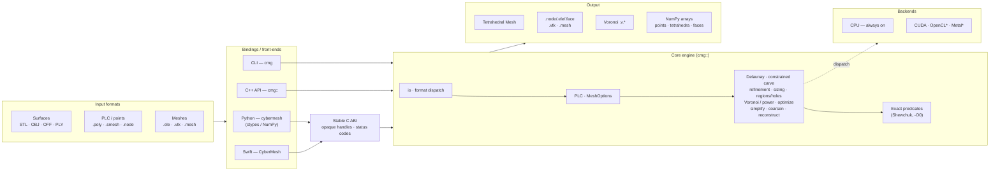
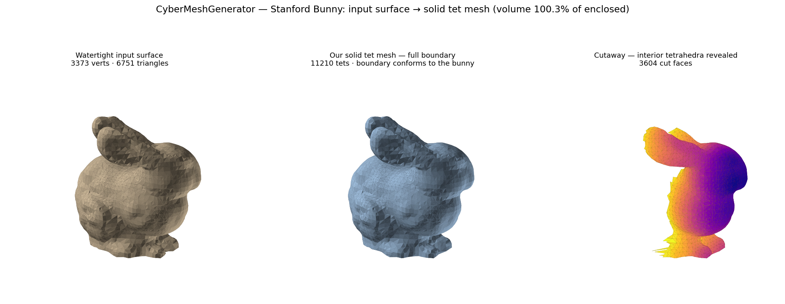
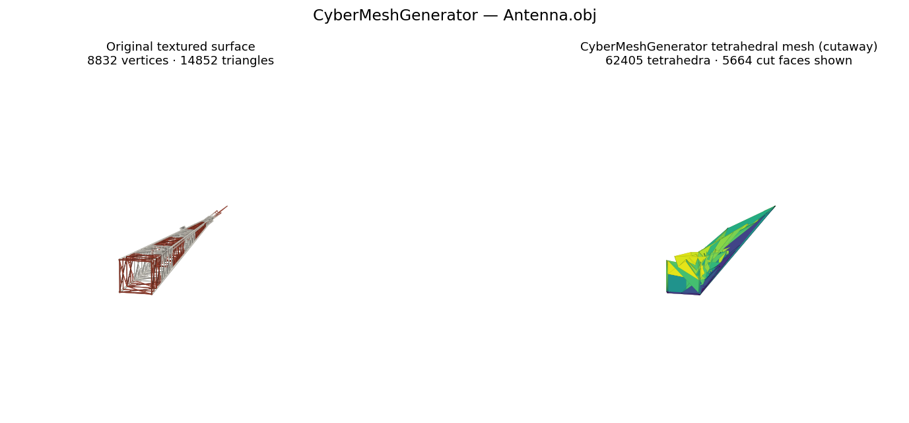

# CyberMeshGenerator

[](https://en.cppreference.com/w/cpp/20)
[](https://cmake.org/)
[](openspec/)

A clean-room **Modern C++20 port of [TetGen](https://codeberg.org/TetGen/TetGen)** —
a Delaunay-based quality tetrahedral mesh generator and 3D Delaunay/Voronoi engine
that runs **everywhere**: pure CPU, GPU desktops/workstations, and mobile
(iOS, Android), with optional **CUDA / OpenCL / Metal** acceleration and
first-class **Python** and **Swift** bindings.

It is the meshing sibling of the CyberdyneCorp scientific stack —
[NumPP](https://github.com/CyberdyneCorp/NumPP) (NumPy port) and
[SciPP](https://github.com/CyberdyneCorp/SciPP) (SciPy port) — and reuses NumPP's
weak-linked device-dispatch substrate rather than building its own.

```cpp
#include "cmg/cmg.hpp"
using namespace cmg;

std::vector<Point3> pts{{0,0,0},{1,0,0},{0,1,0},{0,0,1}};
auto result = delaunay(pts, {});               // -> cmg::expected<Mesh, MeshError>
if (result) {
    const Mesh& m = *result;                   // RAII, owning containers
    // m.tetrahedra, m.faces, m.points ...
}

auto opts = MeshOptions::from_switches("pq1.414a0.1");   // TetGen-compatible
```

## Why it's different from TetGen

- **Modern C++20 API, not char switches** — a typed `MeshOptions` / `PLC` / `Mesh`
  with `std::span`, strong enums and `cmg::expected`, instead of `-pq1.414a0.1`
  strings and raw `tetgenio` arrays. A TetGen switch parser is kept as a
  compatibility layer.
- **Runs everywhere** — one source tree, three build profiles: mobile (CPU-only,
  zero extra deps), desktop, workstation (+GPU). The portable CPU kernel is always
  present and is the only thing required to build.
- **CUDA / OpenCL / Metal** acceleration for the parallelizable phases TetGen runs
  serially, routed through NumPP — always with a CPU fallback the device path
  matches, and identical output topology.
- **Python + Swift bindings** over a stable C ABI, with NumPy interop.
- **Exact predicates preserved** — Shewchuk's adaptive predicates are ported
  verbatim and compiled at `-O0` so the optimizer cannot break their robustness.

## Architecture

A model enters through any front-end, flows through the shared core engine, and comes
back out as mesh files or in-memory arrays. The Python and Swift bindings sit on a
stable C ABI; the CLI and C++ API call the core directly.



<sub>* OpenCL / Metal backends are scaffolded behind the dispatch layer; CPU is always
present and CUDA is validated on real hardware. The Swift binding is source-only in this
release.</sub>

## Python

The `cybermesh` binding (ctypes/NumPy over the stable C ABI) takes a model from file
to mesh with no hand-written parser:

```python
import cybermesh as cm

# Load a surface directly — STL / OBJ / OFF / PLY / native .poly/.smesh:
plc  = cm.read_plc("bunny.stl")
plc  = cm.simplify(plc, grid=48)                 # optional: decimate a dense surface

# Mesh the solid interior (boundary-conforming carve):
mesh = cm.tetrahedralize(plc, cm.MeshOptions(plc=True))
print(mesh.points.shape, mesh.tetrahedra.shape)  # (N, 3) float64, (M, 4) int32

# ...or the Delaunay tetrahedralization of a point cloud / open surface:
mesh = cm.delaunay(cm.read_plc("antenna.obj").points)

# Inspect a loaded PLC's geometry, and read/write meshes (format from extension):
pts, tris = plc.points, plc.triangles            # (N, 3) float64, (M, 3) int32
cm.write_mesh("out.1.ele", mesh)                 # also .vtk / .mesh
```

Build the shared C ABI once, then point the binding at it:

```bash
cmake -S . -B build-py -DCMG_BUILD_C_ABI=ON -DCMG_BUILD_SHARED=ON \
      -DCMG_BUILD_TESTS=OFF -DCMG_BUILD_CLI=OFF && cmake --build build-py -j
export CMG_C_LIB=$(find build-py -name 'libcmg_c.so' | head -1)
export PYTHONPATH=bindings/python/src
python -c "import cybermesh, numpy; print(cybermesh.version())"
```

The same surface goes through the **Swift** binding over the same C ABI
(`CyberMesh.readPLC` / `tetrahedralize` / `simplify` / `delaunay`; see
[`bindings/swift`](bindings/swift)).

## Examples

Worked examples in [`examples/`](examples/) run the **Python** binding on real 3-D
data. Each loads a model natively (`cm.read_plc`), meshes it with CyberMeshGenerator,
and renders the result. See [`examples/native_load`](examples/native_load) for the
minimal file-to-mesh path.

### Stanford Bunny — watertight STL → **solid** interior mesh

`tetrahedralize(plc)` carves the closed bunny into a solid tetrahedral mesh whose
boundary conforms to the shape (not the convex hull). Self-validated: the tet-mesh
volume equals the surface-enclosed volume to **0.2 %**.
([`examples/bunny`](examples/bunny))



### Eiffel Tower — CyberMeshGenerator **vs real TetGen**

Delaunay tetrahedralization of the same points, computed by both tools: total volume
agreeing to **~0.01 %** and **~99 % identical tetrahedra** on real scan data. Both
results are valid Delaunay triangulations; the sub-percent remainder is tie-breaking on
cospherical (grid-clustered) points, where any two independent implementations may
choose differently. ([`examples/eiffel`](examples/eiffel))


### Antenna — open surface → Delaunay of the vertices

A textured OBJ truss (no closed interior) meshed with `delaunay` — 8,832 vertices →
62,405 tetrahedra. ([`examples/antenna`](examples/antenna))



## Build

```bash
just build      # configure + build (portable CPU-only)
just test       # run the foundation test suite
just ctest      # via CTest
just asan       # AddressSanitizer/UBSan
just mobile     # single-precision mobile baseline
just spec       # openspec validate --all --strict
```

Or plain CMake:

```bash
cmake -S . -B build -DCMAKE_BUILD_TYPE=Release
cmake --build build -j
./build/tests/cmg_tests
```

### Options (all default OFF — CPU-only is the baseline)

| Flag | Effect |
|------|--------|
| `CMG_WITH_CUDA` / `CMG_WITH_OPENCL` / `CMG_WITH_METAL` | GPU backend (implies `CMG_WITH_NUMPP`) |
| `CMG_WITH_NUMPP` / `CMG_WITH_SCIPP` | Integrate the NumPP/SciPP stack |
| `CMG_WITH_PYTHON` / `CMG_WITH_SWIFT` | Build the language bindings (over the C ABI) |
| `CMG_WITH_THREADS` | Multithreaded CPU acceleration |
| `CMG_SINGLE` | Single-precision (`float`) REAL, for constrained mobile |

## Licensing

TetGen 1.6.0 is **AGPLv3** with a WIAS commercial dual-license. The license of this
port and its provenance discipline (clean-room reimplementation vs. licensed
derivative) is an **open decision for the maintainer** — see
[`NOTICE.md`](NOTICE.md). Do not distribute before it is settled.

## Reference

- Oracle / reference implementation: TetGen 1.6.0 (`/home/leonardo/work/TetGen`).
- Hang Si, "TetGen, a Delaunay-Based Quality Tetrahedral Mesh Generator",
  ACM TOMS 41(2), 2015.
