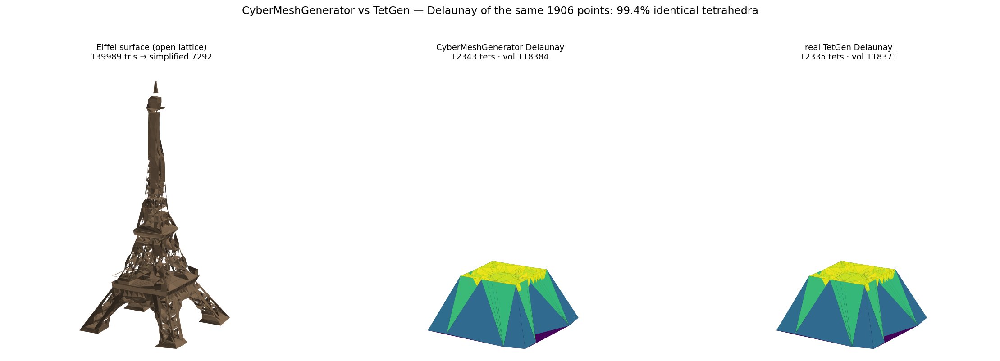
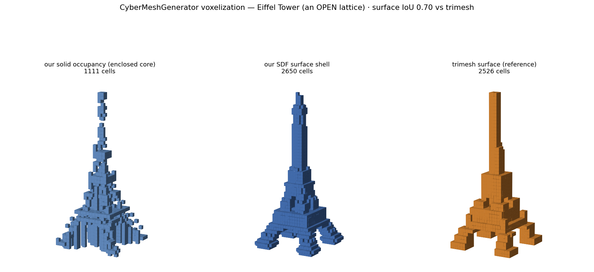

# Eiffel Tower example — CyberMeshGenerator **vs TetGen**, head-to-head

Tetrahedralizes the vertices of an Eiffel Tower STL with both **CyberMeshGenerator**
and **real TetGen**, and compares the results. The STL is loaded natively with
`cybermesh.read_plc` and decimated with `cybermesh.simplify`; TetGen's own output
(`.ele` + `.node`) is read back with `cybermesh.read_mesh` — every step goes through the
library, no hand-parsing or hand-written clustering.



- **Left** — the Eiffel surface (an **open lattice** — a truss, not a watertight
  solid, so there is no closed interior to carve; decimated 139,989 → 7,292 tris).
- **Middle** — CyberMeshGenerator's Delaunay tetrahedralization of the vertices.
- **Right** — **real TetGen**'s Delaunay of the *same* points.

The middle and right panels are near-indistinguishable because the two meshes agree
almost everywhere:

```
OURS   Delaunay: 12343 tets, vol=118384, 24 ms
TETGEN Delaunay: 12335 tets, vol=118371, 14 ms
COMPARE        : identical tetrahedra 12271/12343 = 99.42%  | Δvolume = 12.5 (~0.01%)
```

The total volume agrees to **~0.01 %** and **~99 %** of the tetrahedra are identical to
TetGen's (as sorted vertex tuples), on a real 3D model whose grid-clustered points
contain many coplanar/cospherical configurations. Both outputs are valid Delaunay
triangulations of the same point set — the sub-percent remainder is tie-breaking on
those degenerate configurations, where any two independent implementations may choose a
different (equally valid) diagonal. (A Delaunay tetrahedralization fills the *convex
hull* of the points — the frustum shape in the middle/right — so both tools produce the
same hull-filling mesh, cut away here to show the interior.)

> Exact numbers depend on the simplification grid (the points fed to both tools);
> `cm.simplify(plc, grid=48)` here. The agreement stays in the ~97–99.6 % band across
> grids — the small variation is exactly the cospherical tie-breaking described above.

> The Eiffel STL is ~35 MB and is **not vendored**. Point `EIFFEL_STL` at your copy.
> `TETGEN_BIN` is optional — without it the TetGen panel is skipped and only
> CyberMeshGenerator runs.

## Voxelization — an *open lattice*, and why that matters

The example also **voxelizes** the tower and compares to [`trimesh`](https://trimesh.org).
Unlike the watertight bunny, the Eiffel is an **open, high-genus lattice** (a truss —
0.1 % of its edges are boundary edges and its Euler number is ≈ −12 000, i.e. thousands
of through-holes). That changes what voxelization *means*:



```
our occupancy (solid core): 1111 cells;  SDF surface shell: 2650 cells
surface vs trimesh: IoU=0.704 Dice=0.827 (ours 2650 vs trimesh 2526 surface cells)
```

- **Left — solid occupancy.** Our exact ray-parity fills only the genuinely *enclosed*
  region. On an open lattice most vertical columns cross an even number of beams, so the
  fill is sparse — but it still recovers the tower's solid **core** (central spine, spire,
  legs). This is the honest counterpart to the [bunny](../bunny), where a *watertight*
  input makes solid occupancy well-defined (there it matched trimesh at IoU 0.85).
- **Middle / right — surface voxelization.** The well-defined notion for an open surface
  is "which cells does the surface pass through". Our **signed-distance field** gives it
  (`|sdf| < 0.7·spacing`) — SDF is defined for any mesh, open or closed — and it matches
  trimesh's surface voxels at **IoU 0.70 / Dice 0.83**.

The tower is lightly decimated (`cm.simplify(grid=120)`, ~35k of 140k triangles) only to
keep the **brute-force SDF** tractable — occupancy runs on the full 140k-triangle mesh
directly. (A watertight input is required for the *exact* solid classifier; a spatial
index for the SDF is a documented follow-up.)

## Run it

After building the shared C ABI (see the repo root):

```bash
EIFFEL_STL=/path/to/Eiffel_tower_sample.STL \
TETGEN_BIN=/path/to/tetgen \
CMG_C_LIB=$(readlink -f "$(find ../../build-py -name libcmg_c.so | head -1)") \
PYTHONPATH=../../bindings/python/src python3 run_eiffel.py
```

Requires `numpy` + `matplotlib` (no GUI — renders offscreen via Agg); `trimesh` is
optional and only enables the voxelization comparison (skipped with a note if absent).
